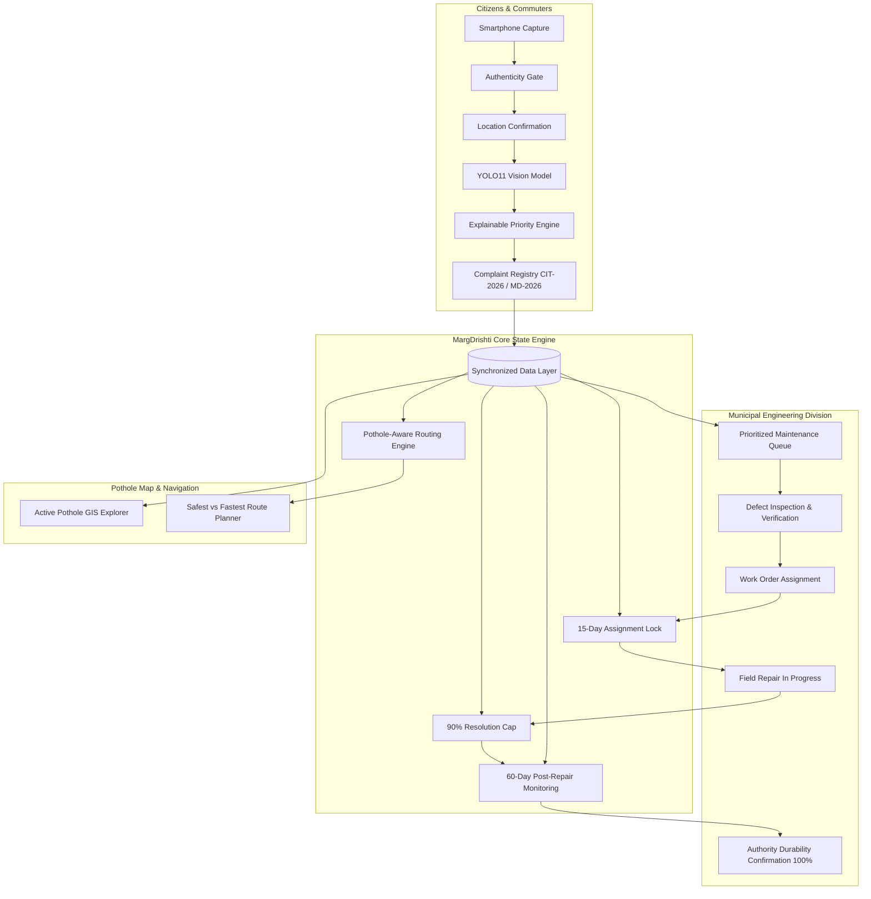

# MargDrishti — Smarter Roads. Safer Journeys.

[](LICENSE)
[]()
[]()

> **AI-Powered Road Damage Detection, Explainable Prioritization & Citizen Reporting System**

---

## 📌 Problem Statement

Indian road infrastructure faces rapid surface degradation due to heavy monsoons, intense vehicular traffic, and delayed defect reporting. Traditional municipal road inspections rely on manual periodic surveys or scattered complaints without standardized severity metrics. Consequently:
- Critical arterial potholes remain unaddressed until severe accidents or traffic gridlocks occur.
- Municipal engineers lack objective, data-backed prioritization criteria.
- Field repairs often suffer from premature deterioration without systematic durability tracking.
- Navigation engines route vehicles through hazardous, cratered roads simply because they appear slightly faster on paper.

**MargDrishti** bridges this critical civic gap through an end-to-end AI vision, explainable risk prioritization, post-repair observation, and pothole-aware navigation platform.

---

## 🌟 Key Features

1. **AI Vision Road Damage Detection (YOLO11)**  
   Automated detection and classification across 4 primary defect classes: `Pothole`, `Longitudinal Crack`, `Transverse Crack`, and `Alligator Crack`, complete with spatial bounding coordinates and confidence scoring.
2. **Pre-Inference Image Authenticity Verification**  
   Modular `imageAuthenticityService` ensuring uploaded road media originates from authentic optical mobile cameras rather than synthetic or generative AI tools.
3. **Dual-Role Citizen & Authority Consoles**  
   - **Citizen Portal:** User registration with official ID (`CIT-2026-XXXXXX`), guided 3-step reporting wizard, GPS or manual map pinpointing, and live lifecycle progression tracking.
   - **Authority Console:** Municipal engineering triage (`AUT-2026-XXXXXX`), priority queue, work order dispatch, and 60-day post-repair monitoring table.
4. **Responsible Civic Authority Identification**  
   Centralized mapping dynamically identifying the exact responsible agency (`Municipal Corporation`, `State PWD`, `NHAI`, `Zilla Parishad`, or `Private Society`) based on road type and jurisdiction.
5. **Explainable 6-Factor Civic Priority Scoring**  
   Combines defect severity, physical extent, road hierarchy, peak transit traffic, sensitive infrastructure (schools/hospitals/metro), and corroborating evidence into a transparent 100-point score.
6. **Strict Workflow Accountability & Locks**  
   - **15-Day Rule:** Enforces a minimum 15-day assignment gap before repair work orders can transition to `In Progress`.
   - **90% Resolution Cap:** Marking a repair completed caps resolution at 90%, triggering a mandatory 60-day post-repair observation cycle.
   - **100% Fully Resolved:** Requires positive durability confirmation by an authorized municipal officer after 60 days.
7. **Pothole-Aware Route Optimization ("Find Best Route")**  
   Evaluates driving routes (`SAFEST`, `FASTEST`, `BALANCED`) using OpenStreetMap/OSRM geometry and dynamic active hazard penalty algorithms (excluding resolved complaints).
8. **Hardware Telemetry Integrity**  
   Captures device Accelerometer, Gyroscope, and GPS metrics via Web APIs, honestly reporting `"Unavailable on this device"` on unsupported hardware without fabricating fake readings.

---

## 🏗️ Architecture



---

## 🛠️ Technology Stack

| Layer | Technologies |
|---|---|
| **Frontend Client** | HTML5, CSS3, ES Modules, Canvas 2D, Leaflet GIS, Lucide Icons |
| **Computer Vision** | YOLO11 Architecture (RDD2022 Indian Subset), OpenCV, PyTorch |
| **Mapping & Routing** | OpenStreetMap, Leaflet.js, OSRM (Open Source Routing Machine), Nominatim |
| **Hardware Telemetry** | Generic Sensor API (`DeviceMotionEvent`, `DeviceOrientationEvent`, `Geolocation API`) |
| **Future Backend (Phase 2)** | Spring Boot 3.3.x (Java 21 LTS), Spring Security 6 (JWT) |
| **Future Database (Phase 2)** | PostgreSQL 16 with PostGIS 3.4 Spatial Extensions |

---

## 📁 Repository Structure

```
MargDrishti/
├── frontend/                  # Responsive Web Client (Dual-Portal)
│   ├── index.html             # Landing Portal & Dual-Role Auth
│   ├── citizen.html           # Citizen Dashboard & Report Wizard
│   ├── authority.html         # Municipal Triage & Monitoring Console
│   ├── map.html               # Pothole Map & Route Planner
│   ├── css/                   # Design System Styles
│   ├── js/                    # ES Modules (Services, Config, Components)
│   └── README.md
├── backend/                   # Spring Boot Microservice Blueprint
│   └── README.md
├── ai-service/                # Deep Learning Inference Service
│   ├── inference/             # Python Predictor & FastAPI Pipeline
│   ├── models/                # YOLO11 Checkpoint Directory
│   ├── requirements.txt       # Python ML Dependencies
│   └── README.md
├── training/                  # Model Fine-Tuning & Datasets
│   ├── dataset/               # RDD2022 Indian Subset Schema
│   ├── scripts/               # YOLO11 Training Scripts
│   ├── configs/               # Dataset YAML Configurations
│   └── README.md
├── docs/                      # Technical Documentation
│   ├── architecture/          # System Architecture Diagrams
│   ├── project-documentation/ # Detailed Workflows & Algorithms
│   └── api/                   # REST API Specifications
├── .gitignore                 # Standard Repository Exclusions
├── README.md                  # Main Documentation
└── LICENSE                    # MIT Open Source License
```

---

## 🚀 How to Run the Prototype

The frontend prototype is fully operational out of the box with zero runtime build dependencies:

### Method 1: Local HTTP Server (Recommended)
```bash
# Using Python
python -m http.server 8080

# Or using Node.js
npx serve .
```
Open `http://localhost:8080` in your browser.

### Method 2: Direct File Access
Open `index.html` (or `frontend/index.html`) directly in any modern desktop or mobile browser (Chrome, Edge, Firefox, Safari).

---

## 🔮 Future Integration Roadmap

- **Spring Boot Backend:** Transition from client storage to distributed microservices.
- **PostgreSQL + PostGIS:** Spatial corridor querying using `ST_DWithin` and spatial clustering.
- **Trained YOLO11 Weights:** Seamless deployment of trained `best.pt` weights to the `ai-service` inference gateway.

---

## 👥 Contributors & Civic Hackathon Team

- **Project:** MargDrishti — Smarter Roads. Safer Journeys.
- **Platform:** SIH 2026 Civic Technology Track
- **License:** [MIT License](LICENSE)
