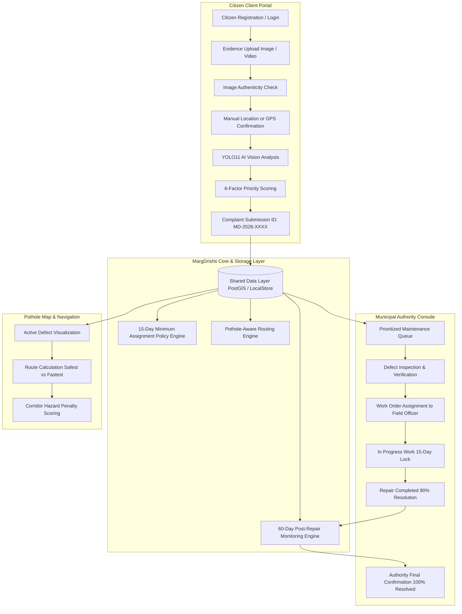

# MargDrishti — System Architecture

---

## Architectural Principles

1. **Dual-Role Segregation with Shared Ground Truth:** Citizens register as civic watchdogs, while municipal engineers authenticate against designated jurisdictions. Both access a unified data model.
2. **Pre-Validation Integrity:** Images pass through an authenticity gate before running YOLO11 road damage object detection.
3. **Accountability Through Strict State Locks:**
   - 15-Day assignment cooldown prevents rushed or uncoordinated work starts.
   - Repair Completed caps resolution at 90%, requiring a 60-day post-repair monitoring cycle before final authority confirmation yields 100% Fully Resolved status.
4. **Explainable Civic Prioritization:** Prioritization uses deterministic, weighted civic risk formulas rather than opaque black-box scoring.
